## **Creational Patterns:**

This pattern is used for the creation of new objects.  
**1\. Factory Method -**  
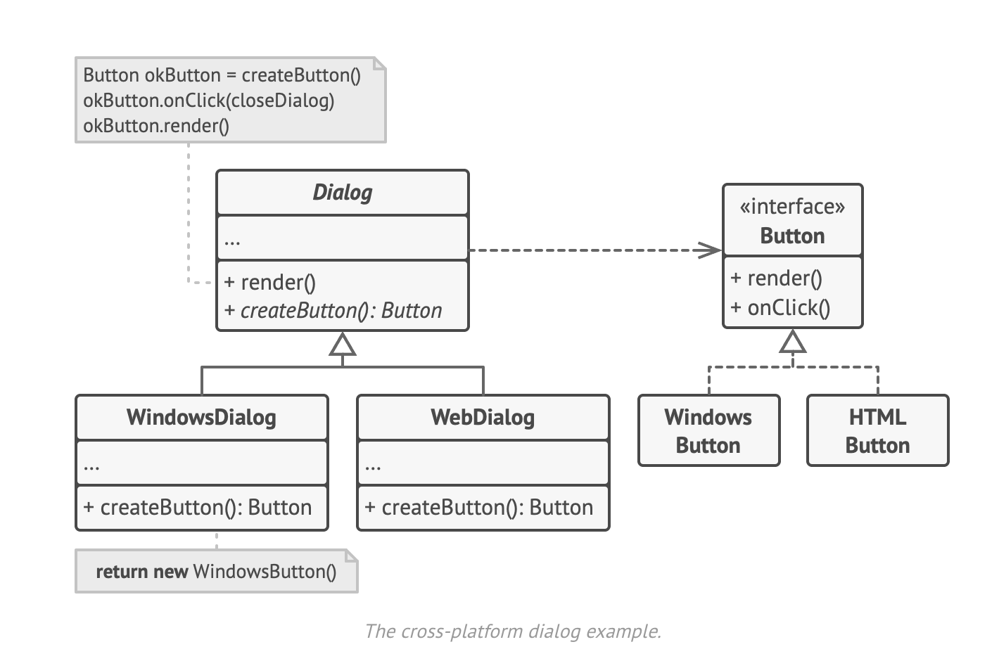

- Use the Factory Method when you don't know beforehand the exact types and dependencies of the objects your code should work with.
- Basically, we need the client code to be abstracted from the underlying implementation of each subclass. Using the factory method, we can return a generic interface (Button) in this case. This makes it easier to add a new Button subclass in the future without requiring significant changes to the client code.

**2\. Abstract Factory -**  
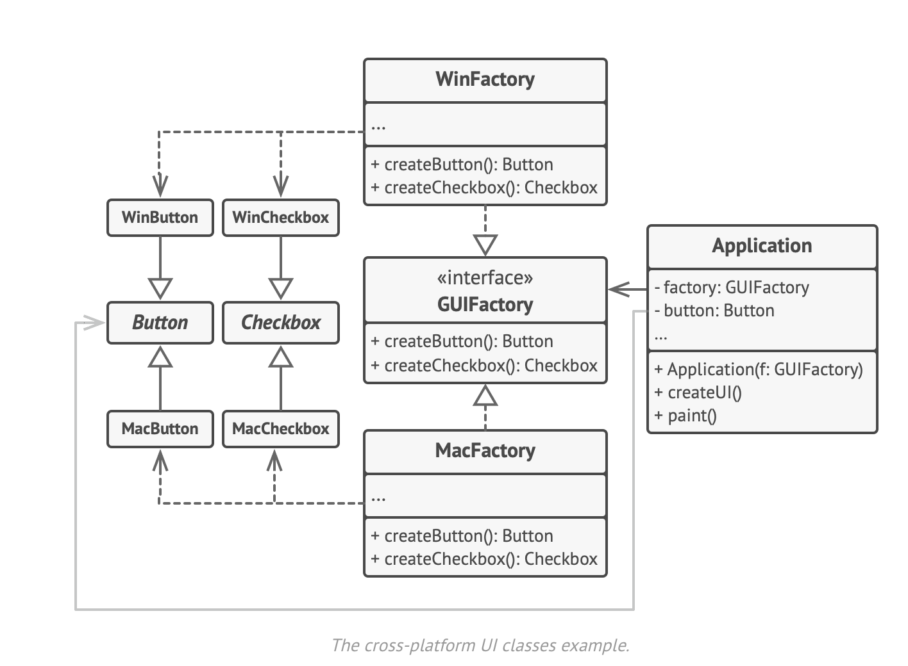

- Abstract Factory is just an extension of the above Factory method. When you have a set of Factory Methods. Use the Abstract Factory when your code needs to work with various families of related products, but you don’t want it to depend on the concrete classes of those products—they might be unknown beforehand or you simply want to allow for future extensibility.
- It's just like the Factory Method, but when you start having multiple related product types, you go with the Abstract Factory Method.
- Simply put, instead of having a Factory Method with multiple if conditionals, you go with this pattern.

**3\. Builder -**  
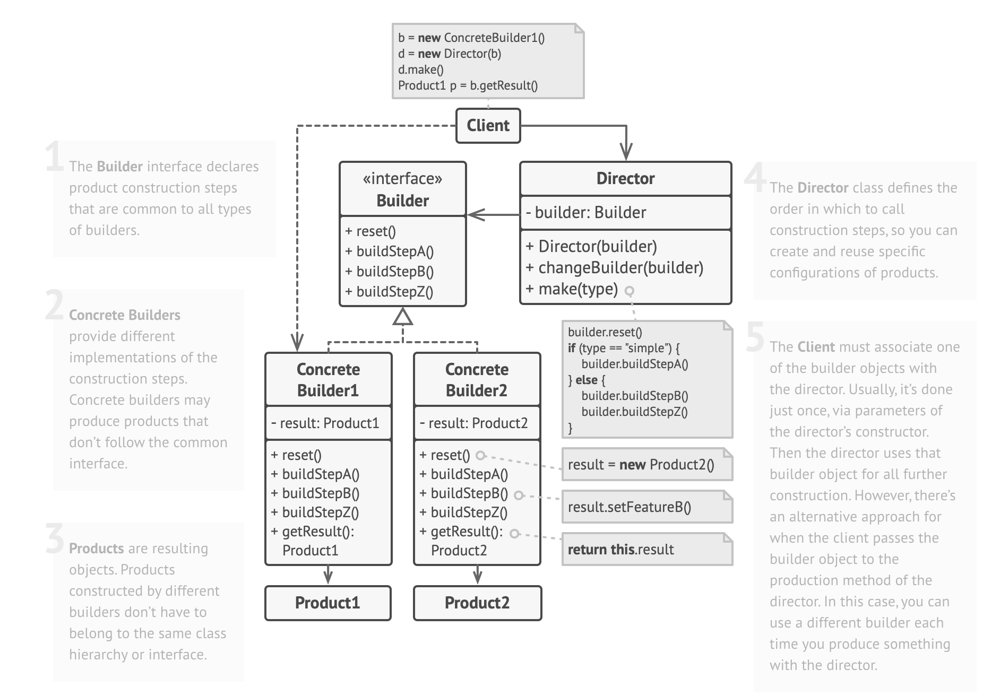

- Use the Builder pattern to get rid of a "constructor with very many parameters." Use it when you have to create multiple objects which are almost similar but just different in small fields like the number of seats or weight.
- Basically, to create your object if you have multiple steps involved, like calling multiple setters, creating different sub-objects, etc., you can do the same thing with the Abstract Factory Pattern, but it's just use-case dependent. When your object creation is a complex multi-step process and each new object differs in just a simple change in a step. So in the abstract pattern, you create a new subclass for each new object you need, but in here, the ConcreteBuilder classes will more or less remain the same, just in the director, based on the type, you can do things like buildStepA(height=2)/buildStepA(height=3). So no new class required, just a parameter change.
- [Builder](https://refactoring.guru/design-patterns/builder) focuses on constructing complex objects step by step. [AbstractFactor](https://refactoring.guru/design-patterns/abstract-factory)y specialises in creating families of related objects. *Abstract Factory* returns the product immediately, whereas *Builder* lets you run some additional construction steps before fetching the product.

\*\*4. ProtoType - \*\*  
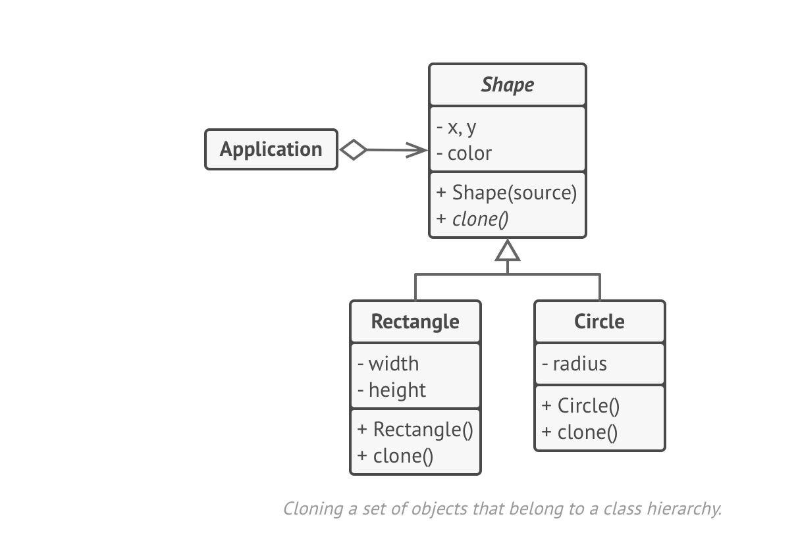

- This Pattern is just a small use case when the client needs to make a copy of an existing object, we generally create a new object() and use get and set repeatedly for all fields. Note that not all classes provide getters for all their fields. Also the client will then be attached to the implementation of that sub class's object(since generally clients deal with interfaces).
- So this pattern says just to have a method clone() in all the classes and client can use it to clone an object, since clone() is present inside the class itself, it can access all its private fields also.

\*\*5. SingleTon - \*\*

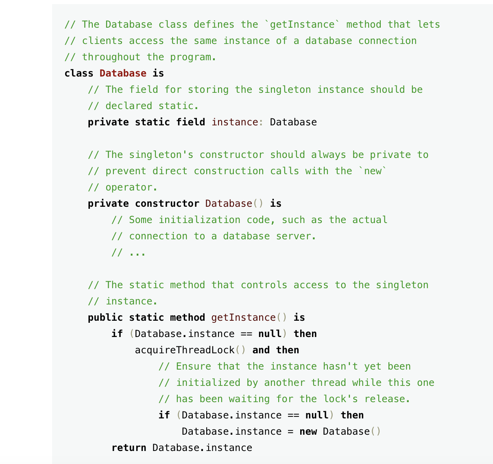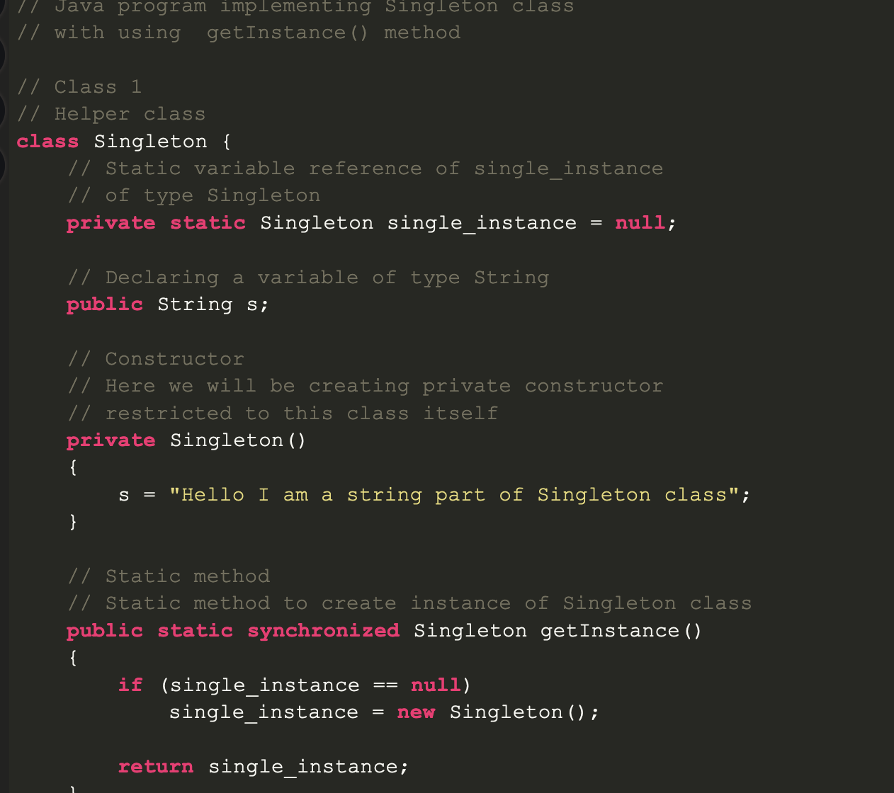

- Use the Singleton pattern when a class in your program should have just a single instance available to all clients; for example, a

single database object shared by different parts of the program.

- For this, generally two steps are done as given in above example -
- The constructor is made private so that no client can call it mistakenly(as constructor always gives a new object every time)
- Create a method that checks if the private static instance of the object(of same class itself) is present and returns accordingly.

* * *

## **Structural Patterns:**

Structural design patterns explain how to assemble objects and classes into larger structures, while keeping these structures flexible and efficient.

\*\*1. Adapter/Wrapper - \*\*Adapter is a structural design pattern that allows objects with incompatible interfaces to collaborate.


- Adapter class is used in cases where we need to convert one class to another and that another class cant simply extend/implement the parent class (may be becoz the another class is a library etc)
- In above example,SquarePeg is a library class which has no relation to classes RoundHole and RoundPeg. Now we need a implementation where we should tell if the squarePeg fits in a roundhole. See that roundHole has a method fits() that takes a roundPeg object.
- So in such cases, since you cant directly change squarePeg class, you create a adapter class and this class will extend the RoundPeg and this class will wrap the squarePeg(private SquarePeg peg;), so wherever you need to use SquarePeg, we will use squarePegAdapter

2.Bridge - The Bridge pattern lets you split the monolithic class into several class hierarchies.

- This is basically used when you are trying to create multiple subclasses.The problem occurs when we’re trying to extend the parent classes in two independent dimensions. I.e. say we have a device interface and we create subclasses - RadioControlledByAdvancedRemote, RadioControlledByNormalRemote, TVControlledByAdvancedRemote, TVControlledByNormalRemote. So logically, device should be extended only to TV and Radio, but we are extending it to a non related dimension of control Remote.
- So by this bridge pattern, we break this and independently have separate class hierarchies for separate dimensions by wrapping one class in another.

  
\*\*3.Component/Object Tree - \*\*

- Using the Composite pattern makes sense only when the core model of your app can be represented as a tree.
- In cases where your app has tree model. You don't want client to know about the details of if client is dealing with child node/leaf node in the tree. Say, a tree format where you can have a Box/Product - A box can have further boxes / a product/(s) only. You need to traverse the tree and get total price of main box.
- So, in such cases, you will have a interface that your tree nodes implement both child and leaf. And the methods will be findPrice(). If its a child node, it will delegate the work to its children. If its leaf(product in this case), it will just return its price.

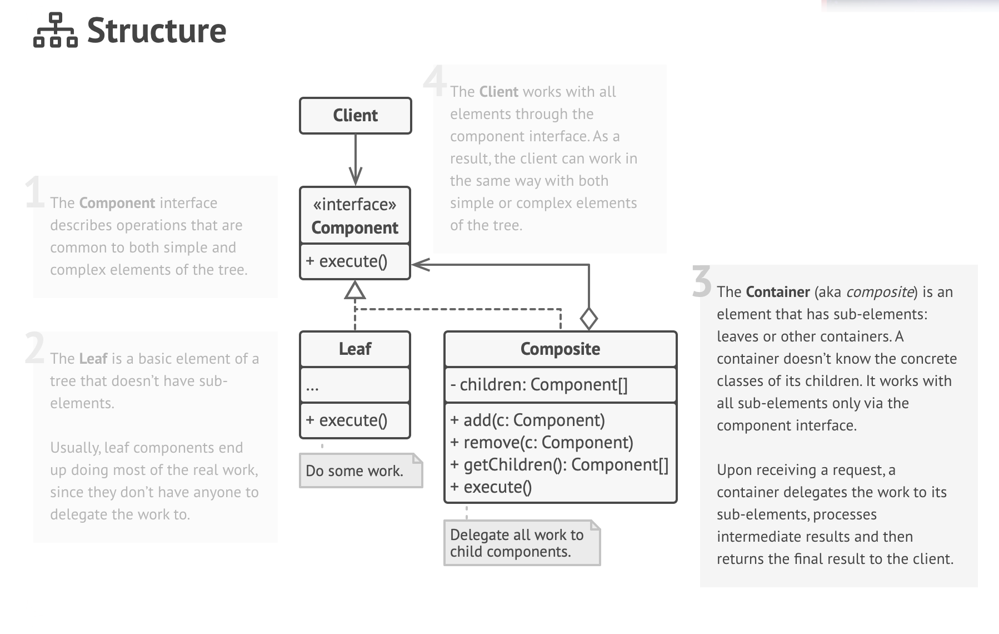

- So, in above - Component is the core interface. Leaf will implement it. Composite(the child node) also implements it and it also has a array of children in it which is a Component\[\].

4\. Decorator/Wrapper - This is used in cases where we have multiple sub classes and we want to create a object that has features of one/more of the subclasses. Simple solution create a new subclass that has same code as the required 2 subclasses code(there will be code duplication also in this case). Also, in such way the number of such subclasses created will be very many.

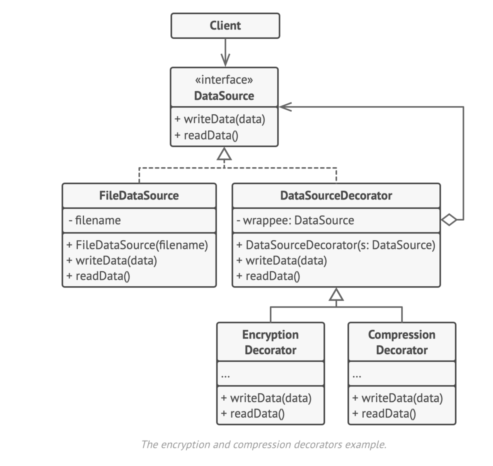

- In above design, without the decorator class, just imagine the EncryptionDataSource and CompressionDataSource classes to extend the FileDataSource class and thats enough if we want to just encrypt/compress.
- What if we want to do both, we cant do it with this design. We may need a new class - EncryptionCompressionDataSource. If we have 10s of classes, then it will lead to creation of 100s of classes for each combination.
- Instead we follow decorator pattern, which is simply wrapping the main object(FileDataSource/the base class) in the decorator class. In this, we have the common interface(Datasource) which is implemented by both decorator and concreteImplClass. The FileDS is the concreteImplClass. There should always be a concrete Impl Class. Now theres the base decorator DSDecorator which just has a private field for DataSource object(that can be a concrete class/concrete decorator), the base decorator does ntg but delegates the work to the wrapee. So just wrapee.writeData()/readData(), no other logic. and then the concrete Decorators,- these have additional custom logic in their methods and finally call super.write/readData().
- Here both FileDataSource and ConcreteDataSourceDecorators(encrptor and com implement the DataSource interface and Encryption, compression classes extend the decorator. Note that decorator contains the private field DataSource(this can be FileDataSource/EncryptionDecorator/CompressionDecorator). Note that the decorator classes will/must have the constructor which initialises the base class(the private field). The encryption and compression decorators although will simply do super(datasource) in their constructors and the write/read methods in them will do encrypt/compress before calling the concrete class's(FileDataSource here) write/read Data method.
- Now in the client , when we want to have a EncryptionDecorator only we do -

`DataSource encrypt = new EncryptionDecorator(new FileDataSource())`

- Similarly if we need both -

`DataSource encryptCompress = new EncryptionDecorator(new CompressionDecorator(new FileDataSource()));`

- So, in this way in runtime we are assigning extra behaviours to objects at runtime without breaking the code that uses these objects and without creating any new classes.

5.Facade -  Use the Facade pattern when you need to have a limited but straightforward interface to a complex subsystem.

- Its basically just creating a wrapper kind of class which gives the clients the required functionalities only and facade only deals with the complex library.

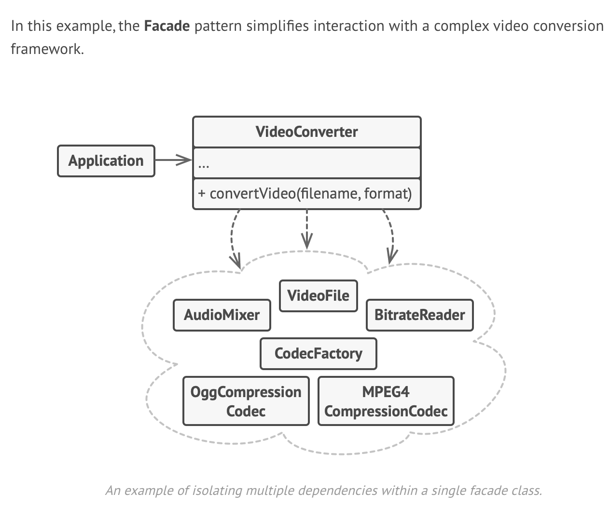

6.FlyWeight - FlyWeight Pattern just tells when you are creating very many number of objects(generally in game dev), extract out the fields from this class which are static for all the objects and have a separate class(called FlyWeight) and remove these fields from the original class. And the original class will wrap the FlyWeight Class.

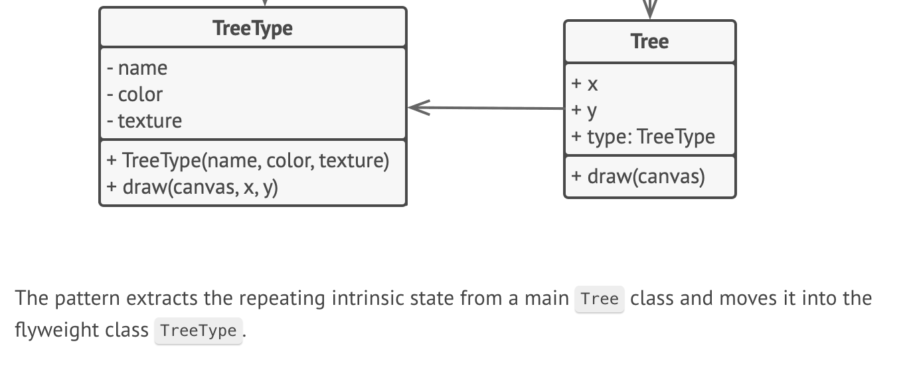

- So, as above the TreeType class is the repeating common fields class. Obv, you will have a TreeFactory Class which creates a Tree object. In that factory logic, we will have if a given TreeType is already present in our collection/set, we return it. Else we create new Obj and return it.

```
class TreeFactory is
    static field treeTypes: collection of tree types
    static method getTreeType(name, color, texture) is
        type = treeTypes.find(name, color, texture)
        if (type == null)
            type = new TreeType(name, color, texture)
            treeTypes.add(type)
        return type
```

- Use the Flyweight pattern only when your program must support a huge number of objects which barely fit into available RAM.

7\. Proxy - Its very similar to facade pattern. The Proxy pattern suggests that you create a new proxy class with the same interface as an original service object and in that proxy class you can have your own extra logic(of preprocessing/post processing/caching etc)


- Unlike *Facade*, *Proxy* has the same interface as its service object, which makes them interchangeable. Facade generally doesn't implement any interface, doesn't have any wrapper field. It does all new object creations() in its method only.

* * *

## **Behavioural Patterns:**

Behavioural design patterns are concerned with algorithms and the assignment of responsibilities between objects.

1.Chain Of Responsibility(COR) -  A behavioural design pattern that lets you pass requests along a chain of handlers. Upon receiving a request, each handler decides either to process the request or to pass it to the next handler in the chain.

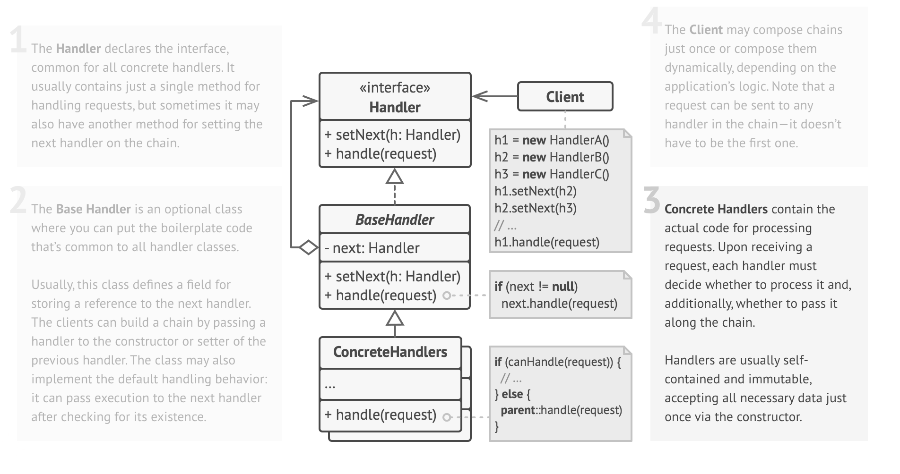

- Like many other behavioural design patterns, the **Chain of Responsibility** relies on transforming particular behaviours into stand-alone objects called *handlers*. In our case, each check should be extracted to its own class with a single method that performs the check
- It’s crucial that all handler classes implement the same interface.

2.Command/Action/Transaction -  It is used in cases of request-response use cases. Where you have a sender - receiver kind of model. Example is Light on,off,up,down

- The purpose of the command pattern is **to encapsulate a request into an object (known as the command)**. The service that must make requests (known as the invoker) does not need to know any details about the request.
- The design is as below - There's sender/invoker which has a command object. The command is an interface and individual commands(ON,OFF etc) are concrete ones which generally has a receiver object(the one which actually contains logic to on/off) and params object - which is the request Object details.

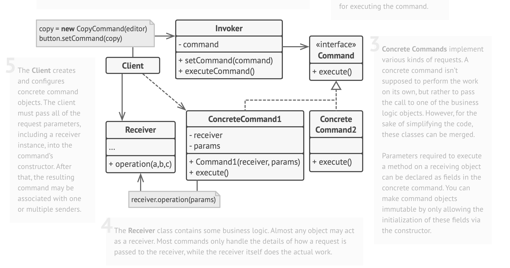[command.webp](../_resources/command.webp)

- In the above, RemoteApplication is the invoker and Light and Speaker are the different Receivers.
- This pattern is also used in cases where we can store the history of commands executed. Basically, we also store the Command\[ \]. So it can be used when\*\* \*\*you want to queue operations, schedule their execution, or execute them remotely(by storing those commands).
- So with command pattern, the UI (ON,OFF etc buttons) are agnostic of under lying implementation.
- Also, tomorrow if we have a new sender i.e. we are getting requests from the button sender, if we have a new sender like dropDown which also does many similar commands like on, off. We can easily extend it without any duplication.

**3.Iterator -** Use the Iterator pattern when your collection has a complex data structure under the hood, but you want to hide its complexity from clients (either for convenience or security reasons) and you want to just iterate through the data(either its a list, graph or any custom ds).

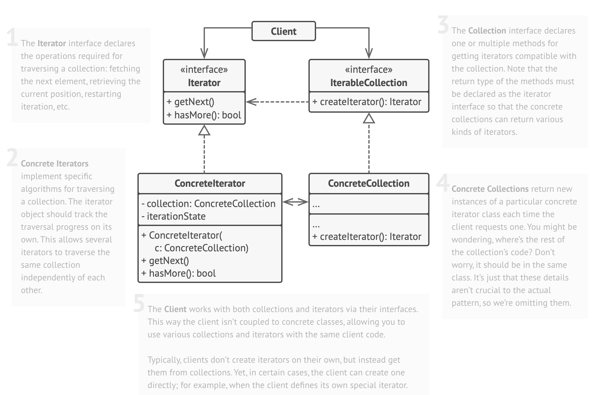

- The design is simple as above, we fundamentally have a iterator Interface which the client will use. The concreteIterator will be dependent of data structure it can be DepthFirstSearchIterator, ListIterator, SocialNetworkIterator. Either way, the concrete Iterator will have a reference of the data structure in it.
- So since the data structure can also be multiple, we have a interface for it also - IterableCollection.

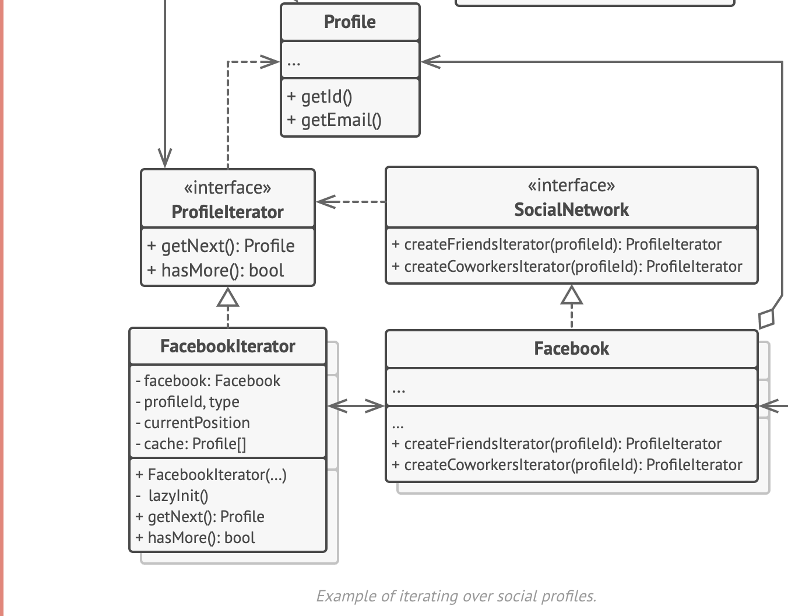

- Also, this pattern is useful to avoid duplication of traversal logic.

4.Mediator - This is used in cases where you have multiple classes and they are interdependent of each other very heavily. This makes tight coupling between the classes. Also the individual classes cant be simply reused for another use cases, as the class is interacting with many other classes, so just using that sole class isnt possible.We create a Mediator which contains all the components(/classes) and it keeps the logic of what to do after executing a class A's action, then call class B's action etc.

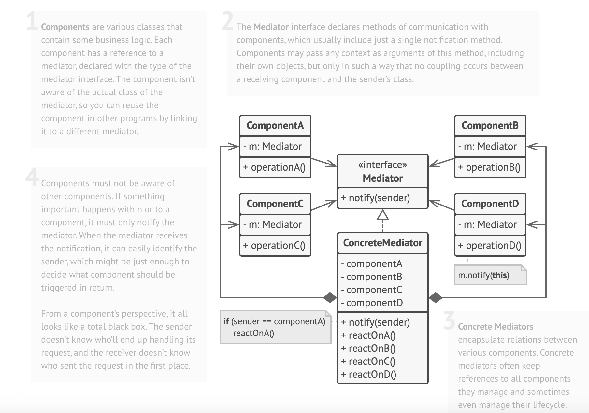

- So, here each component can be like submitAction, ThanksPopupAction, CancelAction, ClearPopupAction etc..
- So we want whenever submit action is done - thankspopup, clearpopup actions to be made. So, a particular new mediator say - submitWithThanks Mediator will have this chain of action logic
- *Chain of Responsibility* passes a request sequentially along a dynamic chain of potential receivers until one of them handles it.
- *Command* establishes unidirectional connections between senders and receivers.
- *Mediator* eliminates direct connections between senders and receivers, forcing them to communicate indirectly via a mediator object. Also Mediator pattern can have links in any order, not just sequential, so CORs cant be used all the time in here.

**5.Memento/Snapshot  -** Use the Memento pattern when you want to produce snapshots of the object’s state to be able to restore a previous state of the object(like in undo).

- The Memento makes the object itself responsible for creating a snapshot of its state. No other object can read the snapshot, making the original object’s state data safe and secure.
- Practically, the object whose state needs to be saved is called an Originator. The Caretaker is the object triggering the save and restore of the state, which is called the Memento.
- The state held in the Memento object doesn’t have to match the full state of the Originator. As long as the kept information is sufficient to restore the state of the Originator, we’re good to go.

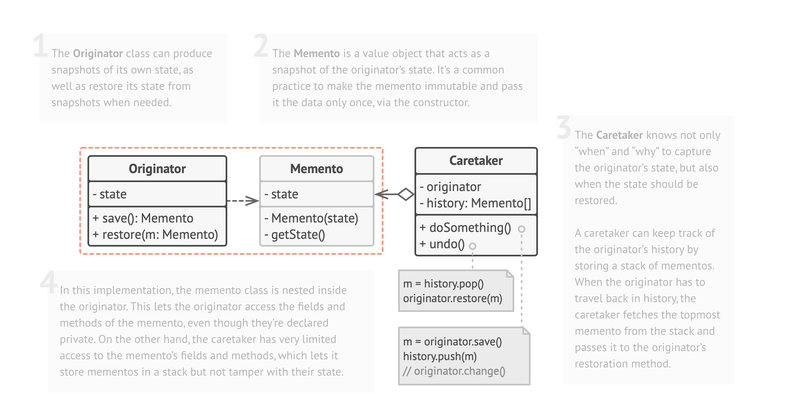

- So, the originator object will have the methods save() which returns a Memento - This logic must be in originator only as originator only will know what fields of it will have to be required to maintain the state(as said above not all fields are always required). In the above example, Memento has just 1 field state, there can be many also. Similarly, it has restore() method, which given a memento will set that memento's field to current originator object's fields to restore the object.
- The caretaker is the one which triggers it. So it obviously needs to have the originator object (thats how you can call [originator.save](http://originator.save)() etc) and a history array also.

6.Observer - Its used whenever we need a publisher - subscriber model kind of design.

- 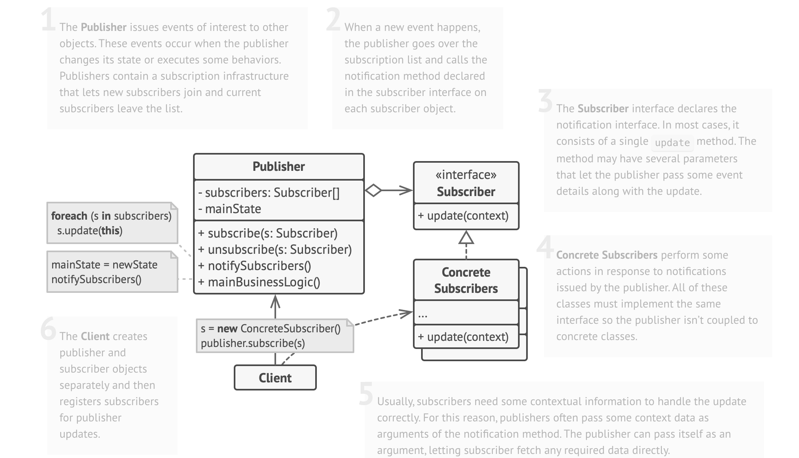
- So as shown above, the publisher class has subscribers\[ \] list, addSubscriber, unsubscribe etc will add and remove them from that list. MainState is the state which is maintaining state of something which we are tracking, whenever this mainState changes, we will notify all our subscribers about it.
- We can have diff kind of subscribers , so all of them implement the interface Subscriber.

**7.State -** **State** is a behavioural design pattern that lets an object alter its behaviour when its internal state changes. It appears as if the object changed its class.

- As said in definition, you have an object and its state can change with time. Now one of the method of this object needs to change with that state. So without conditional ifs(which is bad design as it can very long and Not srp). The State pattern suggests that you create new classes for all possible states of an object and extract all state-specific behaviours into these classes.

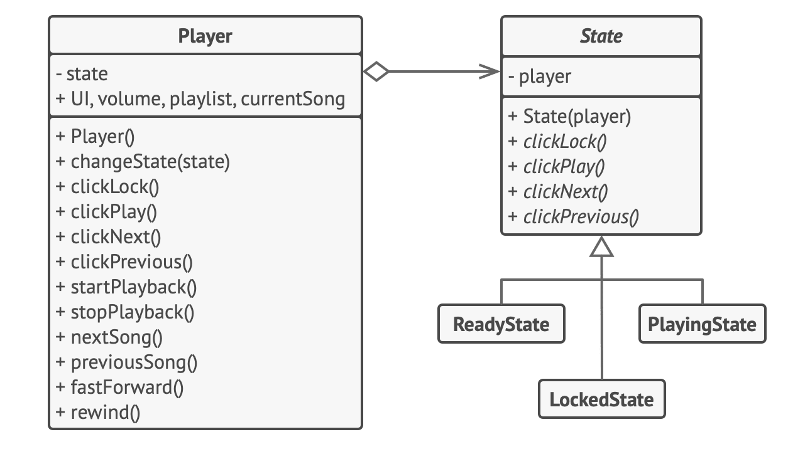

- So as above, the main Object Player will just have a reference to state object and the method in the player will just do this.state.clickLock();
- Its used in cases where we have a FSM kind of model.

**8.Strategy - Strategy** is a behavioural design pattern that lets you define a family of algorithms, put each of them into a separate class, and use those classes in your main class. Its fundamentally same as the state pattern. Its used in cases where you have a use case and depending on some input the algorithm(/strategy) you implement changes.

- The original class, called *context*, must have a field for storing a reference to one of the strategies. The context delegates the work to a linked strategy object instead of executing it on its own.
- The context isn’t responsible for selecting an appropriate algorithm for the job. Instead, the client passes the desired strategy to the context.

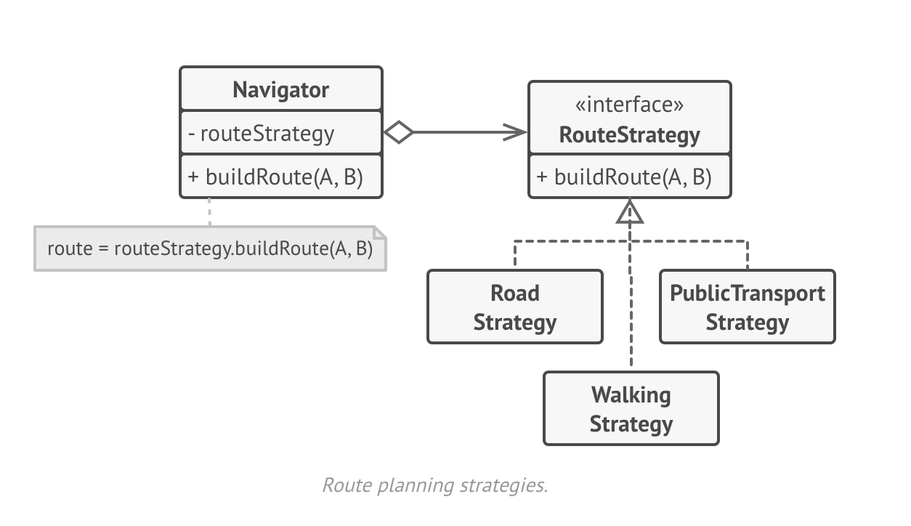

- So we use this pattern when we need to have lot of similar classes which only different in implementing a strategy/algo.

8.Template Method - This defines the skeleton of an algorithm in the superclass but lets subclasses override specific steps of the algorithm without changing its structure.

- So its basically the simplest pattern using inheritance concept.
- When you have a algorithm that you need to implement. Algo is basically a set of steps. Now based on input, say few of the steps change. So in this pattern, our parent class will have the main algo method(the template method). This method basically consists of multiple steps and each of child will have its own implementation of the method. So we are not duplicating the template method's code in all sub classes.
- 
- As seen above, some of the methods will have the default implementation in the abstract class itself and sub classes will only implement the methods which are different for them.
- Use the pattern when you have several classes that contain almost identical algorithms with some minor differences. As a result, you might need to modify all classes when the algorithm changes.

\*\*9.Visitor - \*\*The Visitor pattern lets you execute an operation over a set of objects with different classes.

- The Visitor pattern suggests that you place the algorithm into a separate class called *visitor*, instead of trying to integrate it into existing classes. The original object that had to perform the behaviour is now passed to one of the visitor’s methods as an argument, providing the method access to all necessary data contained within the object.
- You use this when you have a complex data structure like a graph/tree of objects and you need to a implement an external algorithm(not related/part of the objects/nodes in the graph). Its an external algorithm. Say an algorithm like Export the graph to XML/PDF. You go to each node in graph and implement this algorithm. This algorithm wont be in the code of node object as exportXML is a generic algorithm which can be used for any object.
- So, in such cases our each node class(there can be different node classes in our graph - say Building node, Ground node, ConstructionSite Node) and each such node may have a different way to export to XML. So each node class will have a method -

```
accept(v:Visitor){
v.export(this) ;
}
```

. So to export the graph from the client we just do -

```
foreach (Node node in graph)
    node.accept(exportVisitor)
```

- The Visitor is the interface and each impl will have the implementation for a specific type of node.

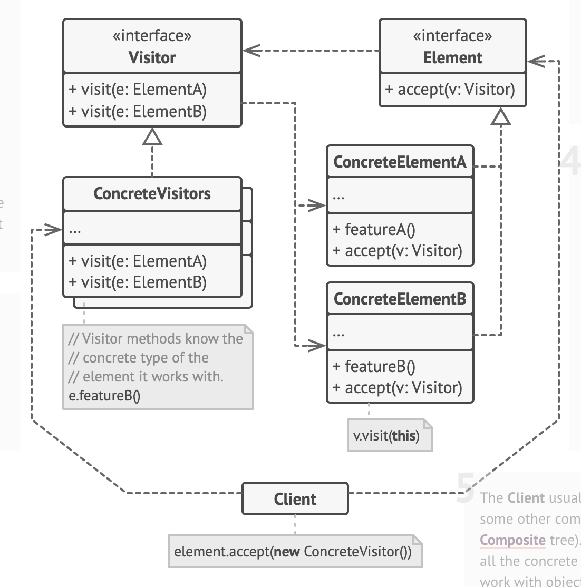

- So as said, the Visitor will have multiple method overloads visit() for each type of node(ConcreteElement here).
- The pattern lets you make the primary classes of your app more focused on their main jobs by extracting all other behaviors into a set of visitor classes.

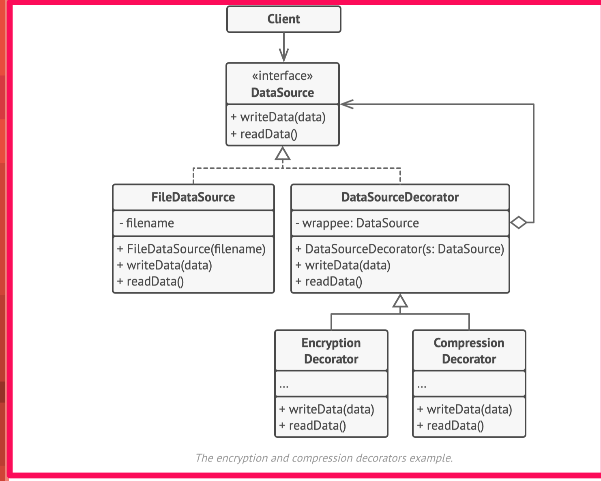  
[command.webp](../_resources/command-1.webp)  
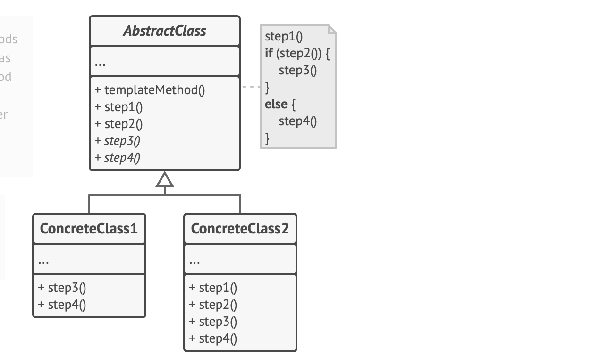